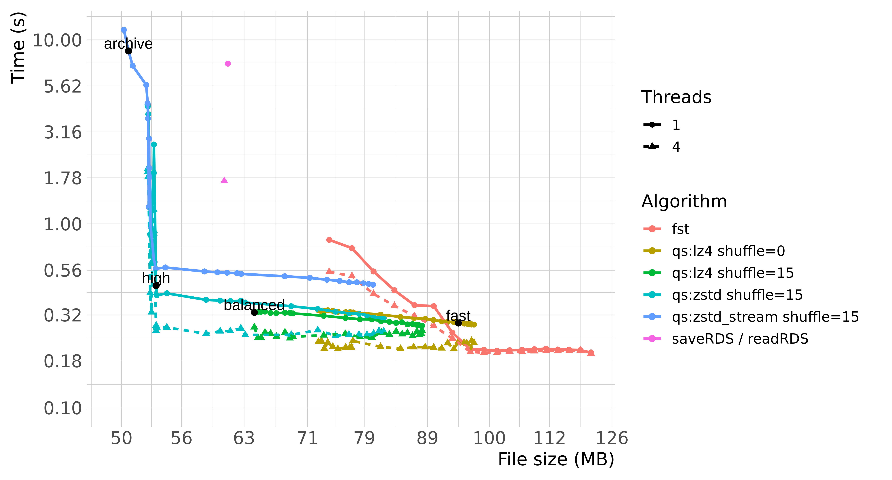
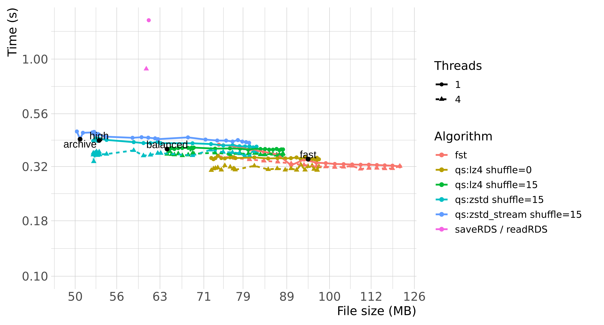
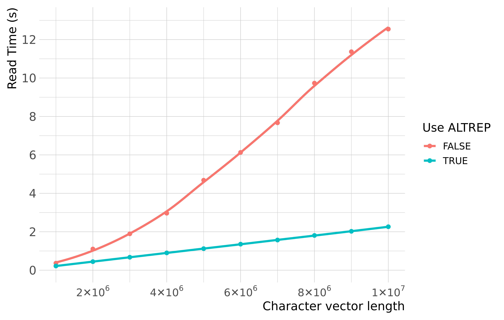

<!--  -->
 
[](https://travis-ci.org/traversc/qs)
[](https://github.com/traversc/qs/actions)
[](https://cran.r-project.org/package=qs)
[](https://cran.r-project.org/package=qs)
[](https://cran.r-project.org/package=qs)

*Quick serialization of R objects*

`qs` provides an interface for quickly saving and reading objects to and from disk. The goal of this package is to provide a lightning-fast and complete replacement for the `saveRDS` and `readRDS` functions in R.

Inspired by the `fst` package, `qs` uses a similar block-compression design using either the `lz4` or `zstd` compression libraries. It differs in that it applies a more general approach for attributes and object references. 

`saveRDS` and `readRDS` are the standard for serialization of R data, but these functions are not optimized for speed. On the other hand, `fst` is extremely fast, but only works on `data.frame`'s and certain column types. 

`qs` is both  extremely fast and general: it can serialize any R object like `saveRDS` and is just as fast and sometimes faster than `fst`.

## Usage
```{r eval=FALSE}
library(qs)
df1 <- data.frame(x=rnorm(5e6), y=sample(5e6), z=sample(letters,5e6, replace=T))
qsave(df1, "myfile.qs")
df2 <- qread("myfile.qs")
```
## Installation
```{r eval=FALSE}
# CRAN version
install.packages("qs")

# CRAN version compile from source (recommended)
remotes::install_cran("qs", type="source", configure.args="--with-simd=AVX2")

# For earlier versions of R <= 3.4
remotes::install_github("traversc/qs@legacy")
```

## Features
The table below compares the features of different serialization approaches in R.

|                    | qs         | fst           | saveRDS  |
|--------------------|:-----------:|:---------------:|:----------:|
| Not Slow             | &#10004;   | &#10004;       | &#10060; |
| Numeric Vectors    | &#10004;   | &#10004;       | &#10004;  |
| Integer Vectors    | &#10004;   | &#10004;       | &#10004;  |
| Logical Vectors    | &#10004;   | &#10004;       | &#10004;  |
| Character Vectors  | &#10004;   | &#10004;       | &#10004;  |
| Character Encoding | &#10004;   | (vector-wide only) | &#10004;  |
| Complex Vectors    | &#10004;   | &#10060;      | &#10004;  |
| Data.Frames        | &#10004;   | &#10004;       | &#10004;  |
| On disk row access | &#10060;  | &#10004;       | &#10060; |
| Random column access | &#10060; | &#10004;      | &#10060;  |
| Attributes         | &#10004;   | Some          | &#10004;  |
| Lists / Nested Lists| &#10004;   |  &#10060;     | &#10004;  |
| Multi-threaded     | &#10004;  | &#10004;      |  &#10060;   |


`qs` also includes a number of advanced features:

* For character vectors, qs also has the option of using the new ALTREP system (R version 3.5+) to quickly read in string data.
* For numerical data (numeric, integer, logical and complex vectors) `qs` implements byte shuffling filters (adopted from the Blosc meta-compression library). These filters utilize extended CPU instruction sets (either SSE2 or AVX2).
* `qs` also efficiently serializes S4 objects, environments, and other complex objects. 

These features have the possibility of additionally increasing performance by orders of magnitude, for certain types of data. See sections below for more details. 

## Summary Benchmarks

The following benchmarks were performed comparing `qs`, `fst` and `saveRDS`/`readRDS` in base R for serializing and de-serializing a medium sized `data.frame` with 5 million rows (approximately 115 Mb in memory):

```{r eval=FALSE}
data.frame(a=rnorm(5e6), 
           b=rpois(5e6,100),
           c=sample(starnames$IAU,5e6,T),
           d=sample(state.name,5e6,T),
           stringsAsFactors = F)
```

`qs` is highly parameterized and can be tuned by the user to extract as much speed and compression as possible, if desired. For simplicity, `qs` comes with 4 presets, which trades speed and compression ratio: "fast", "balanced", "high" and "archive".

The plots below summarize the performance of `saveRDS`, `qs` and `fst` with various parameters:

<!-- TO DO: update table with uncompressed saveRDS, qsave for latest version -->
<!-- ### Summary table -->
<!-- ```{r echo=FALSE} -->
<!-- df <- read.csv("df_bench_summary.csv", check.names=F, stringsAsFactors=F) -->
<!-- df$`Write Time (s)` <- signif(df$`Write Time (s)`, 3) -->
<!-- df$`Read Time (s)` <- signif(df$`Read Time (s)`, 3) -->
<!-- df$`File Size (Mb)` <- signif(df$`File Size (Mb)`, 3) -->
<!-- knitr::kable(df) -->
<!-- ``` -->

### Serializing

{width=576px}

### De-serializing

{width=576px}

*(Benchmarks are based on `qs` ver. 0.21.2, `fst` ver. 0.9.0 and R 3.6.1.)*

Benchmarking write and read speed is a bit tricky and depends highly on a number of factors, such as operating system, the hardware being run on, the distribution of the data, or even the state of the R instance. Reading data is also further subjected to various hardware and software memory caches. 

Generally speaking, `qs` and `fst` are considerably faster than `saveRDS` regardless of using single threaded or multi-threaded compression. `qs` also manages to achieve superior compression ratio through various optimizations (e.g. see "Byte Shuffle" section below). 

## ALTREP character vectors

The ALTREP system (new as of R 3.5.0) allows package developers to represent R objects using their own custom memory layout. This allows a potentially large speedup in processing certain types of data. 

In `qs`, `ALTREP` character vectors are implemented via the [`stringfish`](https://github.com/traversc/stringfish) package and can be used by setting `use_alt_rep=TRUE` in the `qread` function. The benchmark below shows the time it takes to `qread` several million random strings (nchar = 80) with and without `ALTREP`. 

{width=487px}

The large speedup demonstrates why one would want to consider the system, but there are caveats. Downstream processing functions must be `ALTREP`-aware. See the [`stringfish`](https://github.com/traversc/stringfish) package for more details. 

## Byte Shuffle

Byte shuffling (adopted from the Blosc meta-compression library) is a way of re-organizing data to be more ammenable to compression. An integer contains four bytes and the limits of an integer in R are +/- 2^31-1. However, most real data doesn't use anywhere near the range of possible integer values. For example, if the data were representing percentages, 0% to 100%, the first three bytes would be unused and zero. 

Byte shuffling rearranges the data such that all of the first bytes are blocked together, the second bytes are blocked together, and so on  This procedure often makes it very easy for compression algorithms to find repeated patterns and can often improves compression ratio by orders of magnitude. In the example below, shuffle compression achieves a compression ratio of over 1000x. See `?qsave` for more details. 

```{r eval=FALSE}
# With byte shuffling
x <- 1:1e8
qsave(x, "mydat.qs", preset="custom", shuffle_control=15, algorithm="zstd")
cat( "Compression Ratio: ", as.numeric(object.size(x)) / file.info("mydat.qs")$size, "\n" )
# Compression Ratio:  1389.164

# Without byte shuffling
x <- 1:1e8
qsave(x, "mydat.qs", preset="custom", shuffle_control=0, algorithm="zstd")
cat( "Compression Ratio: ", as.numeric(object.size(x)) / file.info("mydat.qs")$size, "\n" )
# Compression Ratio:  1.479294 
```

## Serializing to memory
You can use `qs` to directly serialize objects to memory. 

Example:
```{r eval=FALSE}
library(qs)
x <- qserialize(c(1,2,3))
qdeserialize(x)
[1] 1 2 3
```

## Serializing objects to ASCII

The `qs` package includes two sets of utility functions for converting binary data to ASCII:  

* `base85_encode` and `base85_decode`
* `base91_encode` and `base91_decode`

These functions are similar to base64 encoding functions found in various packages, but offer greater efficiency. 

Example:

``` r
enc <- base91_encode(qserialize(datasets::mtcars, preset = "custom", compress_level = 22))
dec <- qdeserialize(base91_decode(enc))
```
(Note: base91 strings contain double quote characters (`"`) and need to be single quoted if stored as a string.)

See the help files for additional details and history behind these algorithms. 

## Using qs within Rcpp
`qs` functions can be called directly within C++ code via Rcpp. 

Example C++ script:
```
// [[Rcpp::depends(qs)]]
#include <Rcpp.h>
#include <qs.h>
using namespace Rcpp;

// [[Rcpp::export]]
void test() {
  qs::qsave(IntegerVector::create(1,2,3), "/tmp/myfile.qs", "high", "zstd", 1, 15, true, 1);
}
```

R side:
```{r eval=FALSE}
library(qs)
library(Rcpp)
sourceCpp("test.cpp")
# save file using Rcpp interface
test()
# read in file create through Rcpp interface
qread("/tmp/myfile.qs")
[1] 1 2 3
```
The C++ functions do not have default parameters; all parameters must be specified.

## Future developments

* Additional compression algorithms
* Improved ALTREP serialization
* Re-write of multithreading code
* Mac M1 optimizations (NEON) and checking

Future versions will be backwards compatible with the current version.
